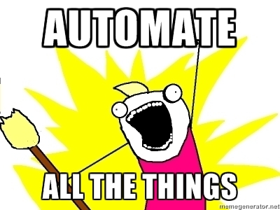

[.title]
= Infrastruktur-Deployment im Auto-Pilot-Mode
Felix Peters - E. Breuninger GmbH & Co

:revealjs_theme: white
:customcss: custom.css
:revealjs_history: true
:icons: font
// 20 minutes
:revealjs_totalTime: 1200
:source-highlighter: highlight.js
:revealjs_transition: slide

:revealjs_width: 1200

:revealjs_pdfseparatefragments: false

== Problem

[%notitle]
=== Problem-Details

* Terraform Provider
* Docker Images
* Software Dependencies (Go, Java, Node etc.)
* Off the Shelf Software
* ...

[%notitle]
=== Softwarestack

[.notes]
--
Wie viele Softwarekomponenten sind in eurem Stack?
Was ist alles versioniert?
--

[%notitle]
=== Problem-Hypothese

_Hypothese_

[%step]
**Engineering macht Spass - Wartung ist doof**

[%step]
_wird deshalb gerne vernachlässigt_

[%step]
erzeugt damit relevante technische Schulden!

[.notes]
--
* Infrastruktur braucht Zeit, Pflege und Updates
* Das steht in Konkurenz zu Features und Projekten
--

=== Lösungsstrategie 1

Ignorieren

=== Lösungsstrategie 2

Mehr Personal

image::images/minions.avif[]

[.notes]
--
* Offensichtlich teuer und nicht zufriedenstellend
--

=== Lösungsstrategie 3

Automatisieren

== Auto Pilot Operations

Ziele | Vorgehen | Lessons Learned

_am Beispiel Hashicorp Vault_

=== Zielsetzung

Der Softwarestack soll jederzeit, *vollständig automatisch* ohne Interaktion eines Menschen aktualisiert werden.

_Im Fehlerfall soll ein Rollback stattfinden._

=== Renovate

image::images/renovate.jpg[]

Automated dependency updates +
Multi-platform and multi-language

=== Renovate

* Automatisches Updaten von Abhängigkeiten als Merge Request
* Von Terraform-Providern über RDS bis zu Docker Images
* Konfigurierbar (z.B. nach Package Typ)
* Shared Service bereitgestellt von OCT

[%notitle]
=== Renovate

[%notitle]
=== Renovate

[.notes]

=== Vorbedingungen

* Semantic Versioning
* (Trunk based) Development in GitLab
* Gitlab Pipelines
* Automatisierung mit z.B. Terraform
* Tests mit z.B. Terratest

[.notes]
--
Ohne das habe ich einfach nur einen Haufen Merge Requests!
--

=== Auto Pilot Pipeline

[.notes]
--
1. Renovate Merge
1. Deploy latest Release auf DEV
1. Run Tests
1. Deploy new MR Code (Upgrade Path)
1. Run Tests
1. Teardown DEV
1. Merge auf master
1. Relase (Semantic Relase)
1. Deploy latest release to PROD
1. Wait for ASG Rollover successfully (including health Check)
1. Rollback & Alert on Failure
--

=== Lessons Learned

[quote]
Ohne gute Tests geht nichts

* Unit-Test für Code
* Integration Tests für Stacks
* Health-Checks für Rollouts
* Monitoring gibt zusätzliche Sicherheit

=== Lessons Learned

[quote]
Es kann nur einen geben

* Renovate ist der führende Version-Manager
* Automatische interne Upgrades (z.B. RDS) müssen deaktiviert sein
* Dafür ist aber immer eine definierte Version ausgerollt

=== Lessons Learned

[quote]
Wait for it

* x.x.0 haben gerne noch Fehler
* Wartezeit für Renovate einbauen

=== Lessons Learned

[quote]
Die Software muss es hergeben

* Manuelle Upgrade Schritte machen es schwer
* Major Upgrades können Tricky sein
* Datenbank-Migrationen erschweren Rollback

== Fazit

[quote]
Lohnt sich das?

[%step]
JA, [.step]#aber es kommt drauf an.#

[.notes]
--
tl;dr: Initial Aufwand, lohnt im long run
Was lohnen ist kommt aber auf den Stack und das Projekt an
-> Hilft aber sich aufs wesentliche zu konzentrieren
--

== Fragen und Diskussion

Jetzt seid ihr dran!